# Get started with Arduino

**1. Windows System**

**1.1 Installing Arduino IDE**

When you get control board, you need to download Arduino IDE and driver
firstly.

You could download Arduino IDE from the official website:

<https://www.arduino.cc/>, click the **SOFTWARE** on the browse bar,
then click“DOWNLOADS” to enter download page, as shown below:

There are various versions of IDE for Arduino. Just download a version
compatible with your system. Here we will show you how to download and
install the windows version of Arduino IDE.

There are two versions of IDE for WINDOWS system. You can choose between
the installer (.exe) and the Zip file. For installer, it can be directly
downloaded, without the need of installing it manually while for Zip
package, you will need to install the driver manually.

You just need to click JUST DOWNLOAD.

After the Arduino is downloaded, click“I Agree”to continue installing

Click **Next**

Then click **Install.**

If the following page appears, click **Install.**

**1.2 Install a driver**

If you have installed the CH340 driver, just skip it.

Connect the main control board to your computer with a USB cable, and
the driver will be installed automatically on MacOS and Windows10
system. If the driver installation process fails, you need to install
the driver manually.

(1) Check whether the computer automatically installs the driver:

Right click Computer----- Click Properties-----Click Device Manager, the
following picture shows the successful installation:

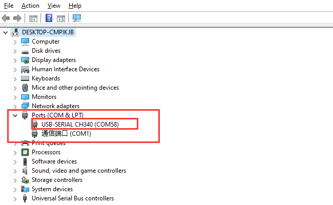

(2) Manual installation:  

Right-click “**USB2.0-Serial**” and click “**Update drive...**”

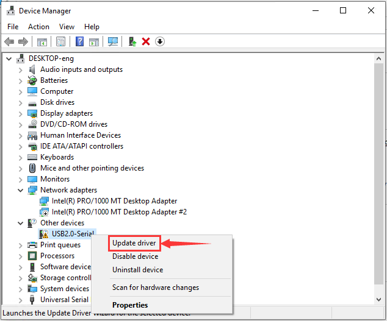

Click “**Browse my computer for driver software**”

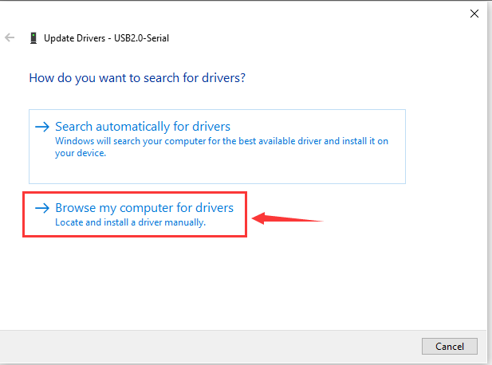

Click“**Browse...**”and select the“**usb\_ch341\_3.1.2009.06 folder**”.

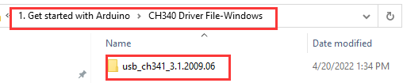

Check the serial port connection status again, as shown in the following
figure, the driver is successfully installed.

  

**1.3. Arduino IDE Setting**

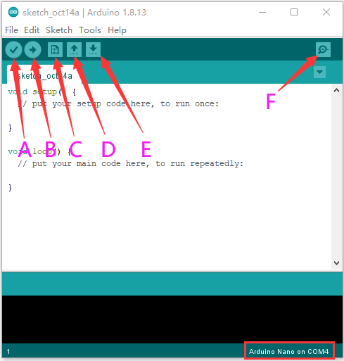

A- Used to verify whether there is any compiling mistakes or not.

B- Used to upload the sketch to your Arduino board.

C- Used to create shortcut window of a new sketch.

D- Used to directly open an example sketch.

E- Used to save the sketch.

F- Used to send the serial data received from board to the serial
monitor.

**1.4. Start your first program**

（1）Click“**File**”, select“**Examples**”，select the **"Blink"** in the
first file **"Basics" .**

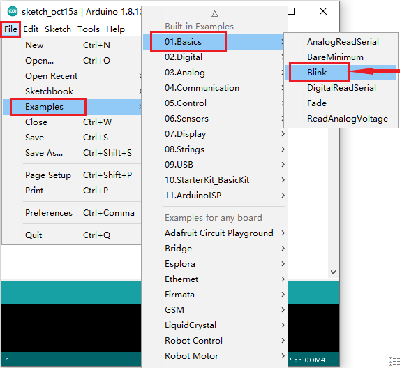

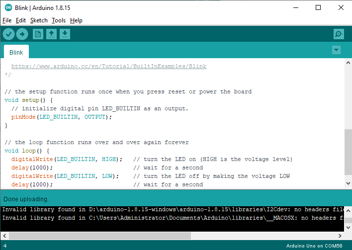

(2) Select the correct mainboard and serial port

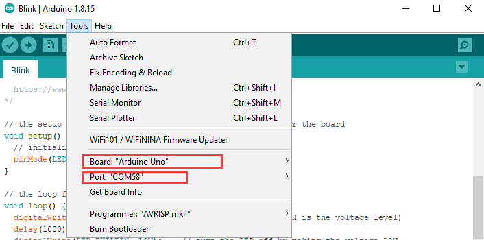

(3) Click icon to upload the code successfully.

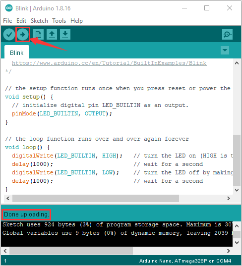

(4) Example test result:

You can see the LED lights flashing on the main control board.  

2.  **Mac System**

**2.1. Download Arduino IDE**

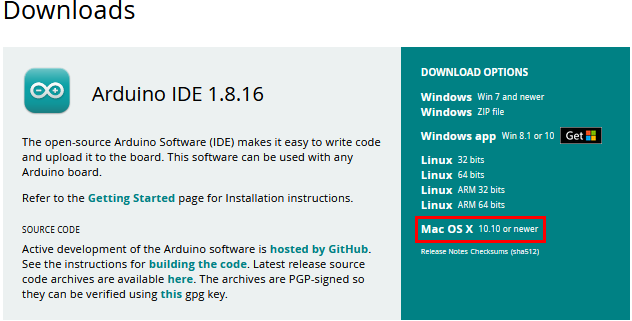

**2.2. Download the CH340 driver：**

<https://fs.keyestudio.com/CH340-MAC>

**2.3. How to install the CH340 driver：**

Please refer to the link ：

<https://wiki.keyestudio.com/Download_CH340_Driver_on_MAC_System>

**2.4. Arduino IDE Setting:**

Except for COM ports, the setting method is the same as in chapter 1.4:

3.  **Add the ESP32 Environment**

（1）Open the arduino IDE，click File \> Preferences，as shown below:

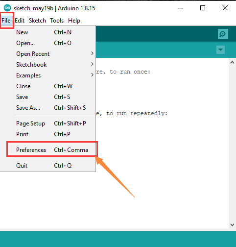

（2）Copy the link：

<https://dl.espressif.com/dl/package_esp32_index.json>

（3）Open the button marked below:

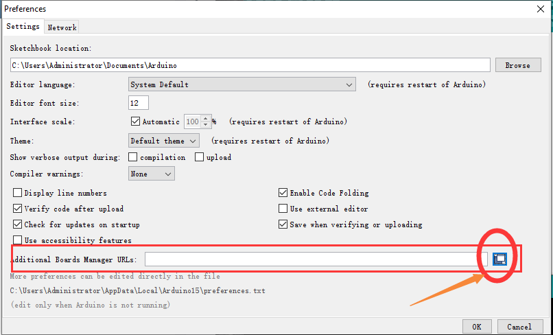

(4) Paste it inside and click OK, as shown below

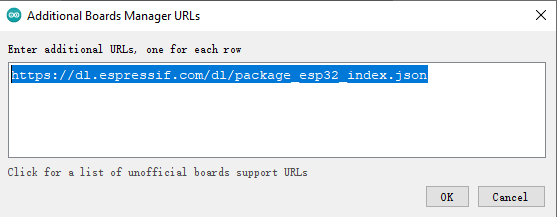

5)  Click Tools \> Board \> Boards Manager

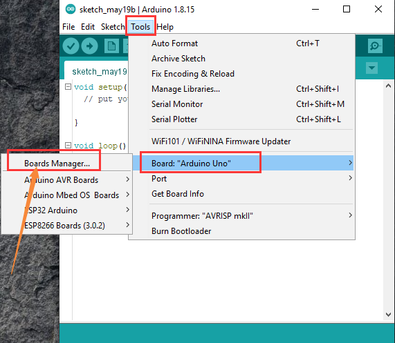

6)  Find the ESP32 from the pop up Boards Manager and then click
    install.
    
    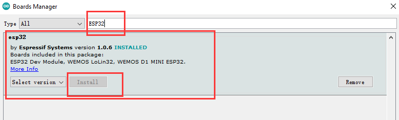

7)  Click Tools \> Board to see the ESP32 Arduino
    
    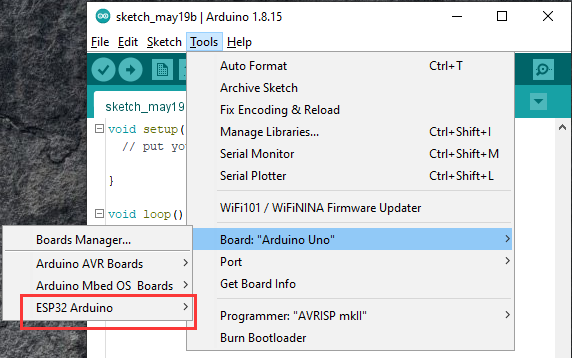

<!-- end list -->

4.  **Add Libraries**
    
    The library files provided are stored in the 1. Get started with
    Arduino \> Arduino Libraries file，as shown below；

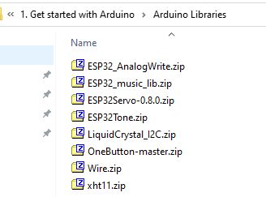

**4.1 Method for Adding library Files in Windows**

(1) Open the Libraries folder in the Installation directory of the
Arduino IDE, as shown below:

Select and click 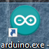 and tap
to install the directory, then enter the
libraries file.

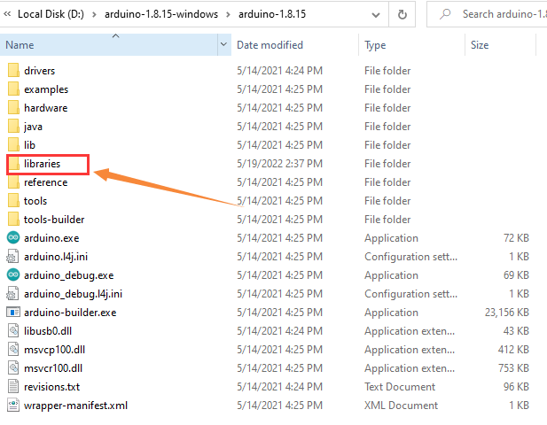

(2) Copy all provided library file packages and paste the library files
into the Arduino IDE libraries folder opened in the previous steps.  

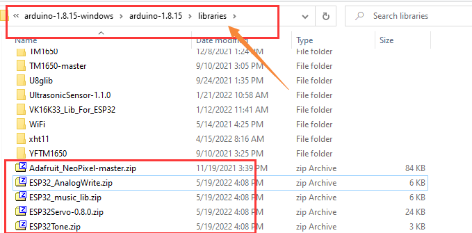

（3）Unzip the library file packages one by one.  

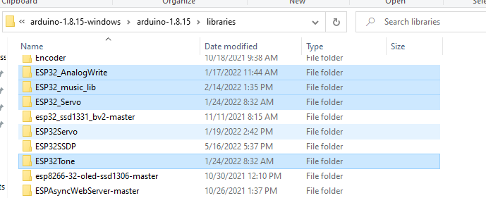

**4.2 Method for Adding library Files in MacOS**

Choose Sketch \> Include Library \> Add.zip Library  

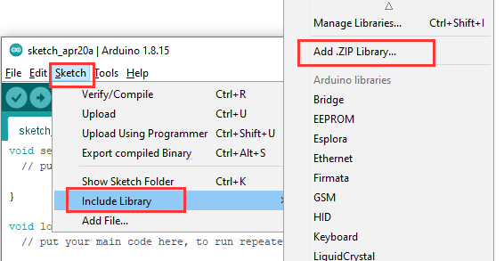

Find the library files and open them. You can only add them one by one,
as shown below:

 The installation is finished.
